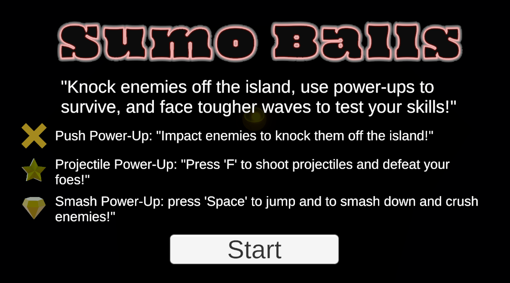

# 🥋 Sumo Battle Prototype 🎮

## 🌟 Overview
Create an exciting arcade-style Sumo battle game! The goal is to knock waves of enemies off a floating island while using power-ups to gain the upper hand. Through this project, you'll master gameplay mechanics that make games fun and engaging. 🎯

---

## 📚 Unit Scope
- **Objective:** Knock enemies off a floating island using power-ups and strategic movement.
- **Skills Developed:** Implement new gameplay mechanics, manage object spawning, and enhance player interactivity.
- **End Goal:** A fully functional Sumo Battle prototype with core game development skills.

---

## 🧪 Lab 4: Basic Gameplay
- Build gameplay mechanics:
  - 🚶 Develop movement and collision detection.
  - 📦 Create reusable prefabs for projectiles, pickups, and enemies.
  - 🎲 Randomize object spawning with a spawn manager.
  - 🎯 Achieve basic functionality for core mechanics.

---

## 🚀 Features Implemented
1. **🌀 Player Movement:** Physics-based controls for realistic interaction.
2. **👾 Enemy AI:** Enemies track and knock the player off the island.
3. **💥 Power-Ups:** Temporary boosts to fight enemies.
4. **🌊 Wave System:** Increasingly challenging waves of enemies.
5. **🎲 Dynamic Spawning:** Random placement of enemies and power-ups.

---

## 🌈 Future Enhancements
- 🤖 Implement advanced AI for smarter enemies.
- 🛡️ Add new power-ups for strategic gameplay.
- 👫 Introduce multiplayer modes.
- 🌍 Expand levels with diverse island designs.

---

## 🎮 Play the Game
Try the Sumo Battle prototype here: [👉 Play Now](<insert_link_here>) 🕹️

---

## 🤝 Contributing
Contributions are welcome! Submit issues or pull requests to improve the project. 💡

---

## 📜 License
This project is released under the MIT License. See `LICENSE` for details. 📄

## 📸 Cover Image:

---

## 🔗 Game Link:
[Click here to play Whack-a-Food](https://play.unity.com/en/games/b3efe3ca-3608-4689-9a40-b82e3e8b68c0/sumo-battle)

---

**Enjoy playing and exploring the Whack-a-Food experience!**
---

## Contributing
Contributions are welcome! Feel free to submit issues or pull requests to improve the project.

---

## License
This project is released under the MIT License. See `LICENSE` for more details.
